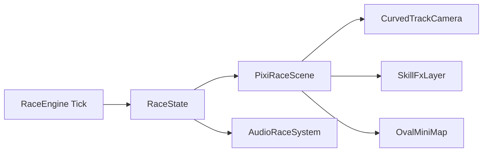

# 🏇 RaceOrder

> 최대 12팀이 참가하는 PixiJS 기반 실시간 레이스 순위 결정 웹 애플리케이션

[](https://github.com/NaldonStudy/umamusmaeORDER)

---

## 📌 프로젝트 개요

`RaceOrder`는 팀 이름, 대표 색상, 스탯, 스킬을 입력한 뒤 레이스를 시뮬레이션해 순위를 결정하는 웹 앱입니다.  
레이스는 틱 기반 엔진으로 진행되며, React UI와 PixiJS 씬을 결합해 주자 위치, 순위, 로그, 결과를 실시간으로 보여줍니다.

현재 프로젝트는 `직선형 진행 UI`를 넘어, `실제 경마장 느낌의 Pixi 레이스 연출`로 확장하는 리빌드 단계에 있습니다.  
핵심 방향은 `스프라이트 달리기 애니메이션`, `타원 트랙 + 카메라 추적`, `스킬 FX`, `관중/질주 오디오` 강화입니다.

---

## 🎯 핵심 기능

| 구분 | 설명 |
|------|------|
| **팀 등록** | 최소 2팀, 최대 12팀까지 이름 / 대표 색상 / 스탯 / 스킬 구성 |
| **실시간 레이스 엔진** | 틱 기반 이동, 추월 판정, 스킬 발동, 결승 시점 기록 |
| **Pixi 레이스 씬** | Pixi 렌더링 루프 기반 레이스 장면, 주자 상태 시각화, 트랙/미니맵 확장 구조 |
| **스킬 연출** | 로그 및 활성 스킬 상태를 기반으로 한 플래시, 트레일, 추월 하이라이트 확장 |
| **실시간 UI 오버레이** | 진행률, 상위 순위, 완주 현황, 스킬 로그 표시 |
| **결과 집계** | 최종 순위와 레이스 주요 기록 요약 |

---

## 🗂️ 화면 흐름

```text
TeamSetup (팀 구성)
    ↓
RaceTrack (카운트다운 + Pixi 레이스 씬)
    ↓
ResultBoard (최종 순위 및 통계)
```

---

## ✨ Pixi 레이스 연출 고도화

레이스 화면 고도화 계획은 `PixiRaceScene`을 중심으로 시각 계층, 트랙 좌표계, FX, 오디오를 단계적으로 확장하는 것입니다.

### 1단계: 핵심 시각 개선

- `Graphics` 기반 러너를 `AnimatedSprite` 기반 러너로 전환해 달리기 모션을 강화합니다.
- 거리 값을 `타원형 트랙 좌표계`로 변환해 실제 코스처럼 주자 위치를 계산합니다.
- 레인별 반지름 오프셋을 사용해 다중 레인을 표현합니다.
- 선두 주자를 기준으로 `카메라가 부드럽게 추적`됩니다.
- 미니맵도 직선 바가 아닌 `오벌 트랙형 미니맵`으로 표시됩니다.
- 관중 영역은 원경 / 중경 / 전경 레이어로 분리해 패럴랙스감을 강화합니다.
- 팀 색상과 스킬 상태에 맞춘 글로우 오버레이를 분리해 주자 가독성을 높입니다.

### 2단계: 고급 연출 및 오디오

- 스킬 로그와 활성 배너를 바탕으로 `burst`, `skill_activate`, `overtaken`, `finish` 이벤트별 연출을 강화합니다.
- 버스트 시 속도선과 후방 트레일, 스킬 발동 시 링 플래시와 짧은 스크린 셰이크를 연결합니다.
- 추월 시 상대적 위치 변화를 강조하는 하이라이트를 추가합니다.
- 배경 관중 함성, 풍절음, 스킬 SFX, 결승 SFX를 포함한 `레이스 오디오 시스템`을 도입합니다.
- 상단 음소거 / 볼륨 UI와 12팀 기준 성능 최적화도 함께 진행합니다.

### 고도화 목표

- 스프라이트 시트 달리기 애니메이션
- 곡선 / 타원 트랙 + 선두 카메라 추적
- 스킬 트레일 / 섬광 / 셰이크 효과
- 관중 연출 및 질주 효과음

---

## ⚙️ 기술 스택

| 분류 | 기술 |
|------|------|
| 프레임워크 | React 19 + TypeScript |
| 빌드 도구 | Vite |
| 렌더링 | PixiJS 8 |
| 상태 관리 | Zustand |
| 스타일 | CSS (`src/styles/race.css`) |
| 배포 | GitHub Pages |
| 오디오 | 레이스 전용 오디오 레이어 (`src/lib/audioRace.ts`) |

---

## 📁 프로젝트 구조

```text
umamusmaeORDER/
├── src/
│   ├── components/
│   │   ├── TeamSetup.tsx
│   │   ├── RaceTrack.tsx
│   │   ├── PixiRaceScene.tsx
│   │   ├── SkillFlash.tsx
│   │   ├── SkillLog.tsx
│   │   └── ResultBoard.tsx
│   ├── lib/
│   │   ├── raceEngine.ts
│   │   ├── audioRace.ts
│   │   └── pixi/
│   │       ├── trackMath.ts
│   │       ├── runnerLayer.ts
│   │       └── fxLayer.ts
│   ├── store/
│   │   └── raceStore.ts
│   ├── types/
│   │   └── race.ts
│   └── styles/
│       └── race.css
├── README.md
└── USAGE_GUIDE.md
```

### 주요 파일 역할

| 파일 | 역할 |
|------|------|
| `src/components/RaceTrack.tsx` | 카운트다운, 틱 진행, 레이스 HUD 구성 |
| `src/components/PixiRaceScene.tsx` | Pixi 앱 초기화 및 프레임 렌더링 |
| `src/lib/raceEngine.ts` | 위치 계산, 스킬 발동, 순위 판정 |
| `src/lib/audioRace.ts` | 관중 함성, 질주음, 스킬/결승 SFX 제어 |
| `src/lib/pixi/trackMath.ts` | 거리 → 트랙 좌표 / 미니맵 좌표 변환 |
| `src/lib/pixi/runnerLayer.ts` | 주자 렌더링 및 상태 갱신 |
| `src/lib/pixi/fxLayer.ts` | 먼지, 플래시, 셰이크 등 이펙트 관리 |

---

## 🧠 데이터 흐름



---

## 🏁 레이스 엔진 요약

```text
매 틱마다:
  기본 속도
  + 랜덤 편차
  + 컨디션 보정
  + 활성 스킬 효과
  = 이동 거리

이후:
  위치 갱신
  → 순위 재정렬
  → 추월 / 스킬 / 결승 로그 생성
  → HUD / Pixi 씬 / 결과 화면에 반영
```

### 대표 스킬 예시

| 스킬명 | 발동 조건 | 효과 |
|--------|-----------|------|
| 선두 질주 | 1위 유지 중 | 속도 증가 |
| 막판 스퍼트 | 잔여 거리 20% 이하 | 후반 가속 상승 |
| 추격의 불꽃 | 중하위권 진입 시 | 순간 추월력 강화 |
| 랜덤 부스트 | 무작위 타이밍 | 단기 속도 상승 |
| 방해 저항 | 경쟁 밀집 구간 | 감속 저항 |
| 침착한 페이스 | 전반 구간 | 스태미나 소모 완화 |

---

## 🚀 실행 방법

```bash
npm install
npm run dev
```

빌드와 배포:

```bash
npm run build
npm run preview
npm run deploy
```

기본 개발 서버 주소는 `http://localhost:5173`입니다.

---

## 🛣️ 구현 로드맵

1. `trackMath`, `runnerLayer`, `fxLayer` 중심으로 Pixi 씬 구조를 모듈화해 유지보수 기반 확보
2. 스프라이트 러너 + 타원 트랙 + 타원 미니맵 1차 완성
3. `burst`, `skill_activate`, `overtaken` 로그 기반 고급 FX 연결
4. `audioRace` 기반 오디오 시스템과 음소거 / 볼륨 UI 추가
5. 12팀 기준 부하 테스트 및 파티클 / GC 최적화

### 검증 기준

- 12팀 참가 시 체감 프레임 드랍이 크지 않을 것
- 곡선 트랙과 미니맵의 위치 동기화가 정확할 것
- 스킬 발동 / 추월 / 결승 시 시청각 피드백이 즉시 반응할 것
- 기존 순위 계산, 결과 집계, 로그 흐름이 회귀 없이 유지될 것

---

## ⚠️ 주의사항

본 프로젝트는 경주 레이스 장르에서 영감을 받아 독자적으로 제작된 앱입니다.  
특정 기존 IP의 캐릭터, UI, 사운드, 텍스트 에셋을 그대로 사용하지 않는 것을 원칙으로 합니다.

---

## 📄 라이선스

MIT License

---

## 🔗 관련 문서

- [USAGE_GUIDE.md](./USAGE_GUIDE.md) — 실제 사용 흐름과 레이스 화면 안내
